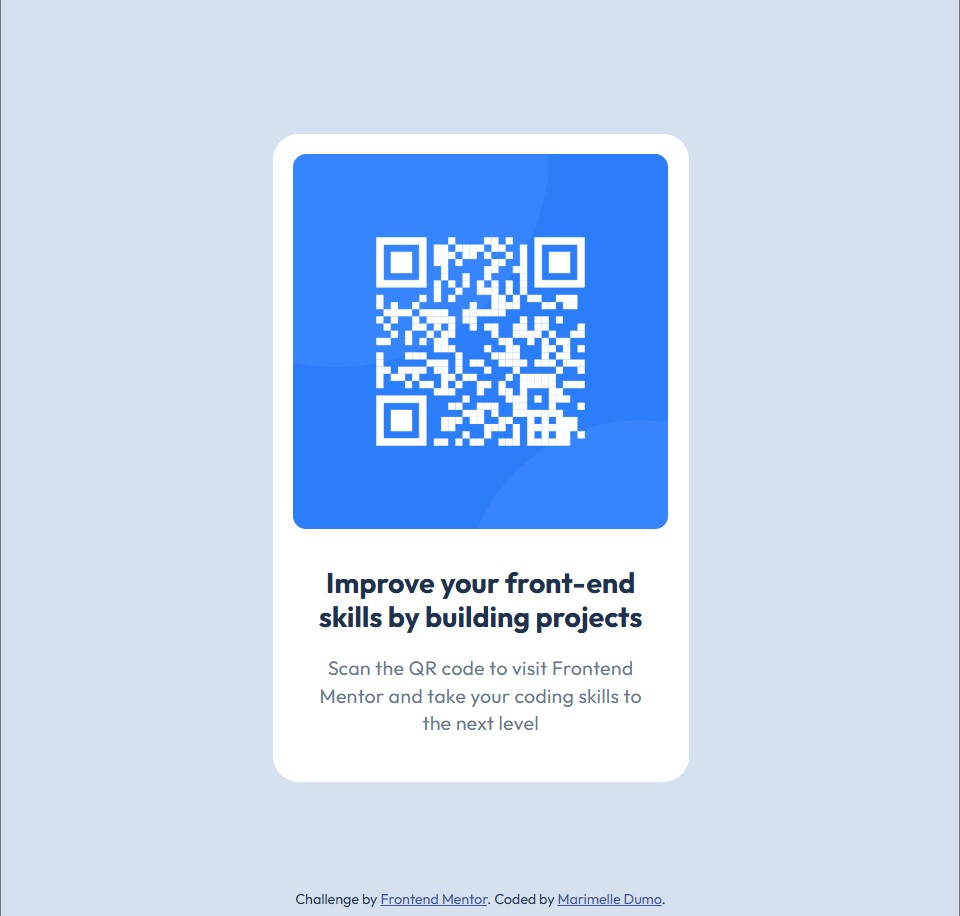

# Frontend Mentor - QR code component solution

This is a solution to the [QR code component challenge on Frontend Mentor](https://www.frontendmentor.io/challenges/qr-code-component-iux_sIO_H). Frontend Mentor challenges help you improve your coding skills by building realistic projects. 

## Table of contents

- [Overview](#overview)
  - [Screenshot](#screenshot)
  - [Links](#links)
- [My process](#my-process)
  - [Built with](#built-with)
  - [What I learned](#what-i-learned)
- [Author](#author)

## Overview
A simple, accessible QR code card built with HTML & CSS.

### Screenshot



### Links

- Solution URL: [https://github.com/Marimelle/qr-code-component/tree/main](https://github.com/Marimelle/qr-code-component/tree/main)

- Live Site URL: [https://marimelle.github.io/qr-code-component/](https://marimelle.github.io/qr-code-component/)

## My process

### Built with

- **Semantic HTML5** – Uses Semantic HTML for accessibility.

- **CSS Best Practices** – Flexbox, relative units (rem) and CSS variables.

### What I learned

#### 1. Flexbox Mastery for Centering

  **Problem**: Vertically/horizontally centering the card was tricky initially.

  **Solution**: Used Flexbox on the `<body>` with minimal code:

```css
body {
  background-color: var(--slate-300);
  display: flex;
  min-width: 320px;
  min-height: 560px;
  height: 100vh;
  flex-flow: column nowrap;
  place-items: center;
}
```

#### 2. Semantic HTML for Accessibility

**Problem**: The original layout only had plain text inside the `<body>`, with a simple `<div>` for the attribution.

**Solution**:
- Replaced the basic structure with semantic HTML:

  - Wrapped the QR code, heading, and paragraph in `<main>` to define the primary content.

  - Used `<footer>` for the attribution instead of a generic `<div>`.

- Styled `<main>` as a Flexbox container for better alignment

## Author

- Github - [Marimelle](https://github.com/Marimelle)

- Frontend Mentor - [@Marimelle](https://www.frontendmentor.io/profile/Marimelle)
